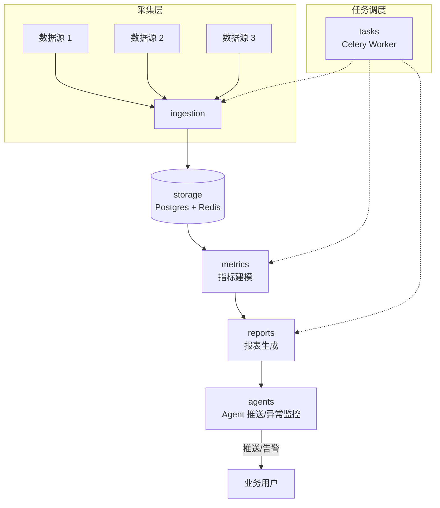

<div align="center">

# 🛰️ SkyNet · 天网

  

**让 [企业] 在 [数据驱动决策] 中 [通过多源抓取 + Agent 推送 + 异常监控完成指标治理]**

[](#-开发状态)
[](https://www.python.org)
[](https://fastapi.tiangolo.com)
[](https://pola.rs)
[](LICENSE)
[](#-开发状态)

[📖 架构设计](docs/superpowers/specs/2026-03-18-skynet-architecture-design.md) · [🤝 贡献](.github/CONTRIBUTING.md) · [🐛 Issues](https://github.com/davyzhong/SkyNet/issues)

</div>

---

## 这是什么

**天网（SkyNet）** 是一个企业数据智能平台。它从多源异构数据中持续抓取、按业务维度构建指标体系、生成数据洞察报表，并通过 AI Agent 完成数据推送与异常监控。

**第一句**：把"散落数据 → 可信指标 → 业务洞察"自动化。
**为什么选 SkyNet**：基于 Polars 的高性能数据处理 + 基于 Celery 的任务调度 + 与 Anthropic Claude 集成的 Agent 推送链路。

> ⚠️ **开发状态**：项目处于早期开发阶段，架构与模块边界在迭代中定型。详见 [架构设计文档](docs/superpowers/specs/2026-03-18-skynet-architecture-design.md)。

---

## ✨ 卖点

- 🛰️ **多源抓取** — 异构数据源接入与统一入库（`app/ingestion/`）
- 📊 **指标体系** — 可信指标建模与治理（`app/metrics/`）
- 📑 **洞察报表** — 自动生成数据洞察报告（`app/reports/`）
- 🤖 **Agent 推送** — Claude 驱动的数据推送与异常告警（`app/agents/`）
- ⚡ **高性能处理** — Polars + asyncpg + Redis + Celery 的现代数据栈

---

## 🏗️ 架构



| 模块 | 职责 |
|---|---|
| `app/ingestion/` | 多源数据采集与 ETL |
| `app/metrics/` | 指标定义、计算与可信度治理 |
| `app/reports/` | 报表生成与洞察摘要 |
| `app/agents/` | AI Agent 编排：推送、调查、异常 |
| `app/storage/` | Postgres + Redis 持久化层 |
| `app/tasks/` | Celery 异步任务与定时调度 |
| `app/main.py` + `app/config.py` | FastAPI 入口与配置加载 |

---

## 🚀 快速开始

### 前置

- Python 3.11+
- PostgreSQL 14+ / Redis 6+
- 可选：Anthropic API Key（用于 Agent 推送）

### 从源码安装

```bash
git clone https://github.com/davyzhong/SkyNet.git
cd SkyNet
python3.11 -m venv .venv
source .venv/bin/activate
pip install -e ".[dev]"
cp .env.example .env  # 编辑连接信息
```

### 启动 API 服务

```bash
uvicorn app.main:app --reload
```

打开 [http://127.0.0.1:8000/docs](http://127.0.0.1:8000/docs) 查看 Swagger UI。

### 启动 Worker（Celery）

```bash
celery -A app.tasks worker -l info
```

### 数据库迁移

```bash
alembic upgrade head
```

### Docker Compose 一键启动

```bash
docker compose up -d
```

启动 Postgres + Redis + API + Worker。

---

## 📦 功能矩阵

| 能力 | 模块 | 状态 |
|---|---|---|
| 数据源接入（DB / API / 文件） | `ingestion` | ✅ 早期实现 |
| 指标建模 | `metrics` | 🚧 规划中 |
| 报表生成（PDF / Dashboard） | `reports` | 🚧 规划中 |
| Agent 推送（Slack / Email / Webhook） | `agents` | 🚧 规划中 |
| 异常监控与告警 | `agents` | 🚧 规划中 |
| 任务调度 | `tasks` (Celery) | ✅ 早期实现 |
| 多租户隔离 | `storage` | ⏳ 路线图 |

---

## 🆚 与同类对比

| 维度 | SkyNet | 传统 BI | Airflow + dbt |
|---|---|---|---|
| 实时数据推送 | ✅ Agent | ❌ 手动 | ❌ 需自建 |
| 异常自动告警 | ✅ 内建 | ⚠️ 阈值配置 | ❌ 需自建 |
| 指标治理 | ✅ 一等公民 | ⚠️ 报表级别 | ⚠️ 任务级别 |
| 高性能引擎 | Polars | 视厂商 | 视场景 |
| 自托管友好 | ✅ | ❌ 多为 SaaS | ✅ |

---

## 🗓️ Roadmap

- [x] v0.1 基础工程骨架（FastAPI + Celery + Polars）
- [ ] v0.2 ingestion 多源连接器（Postgres / MySQL / REST / S3）
- [ ] v0.3 metrics 指标定义 DSL 与血缘追踪
- [ ] v0.4 reports 自动报表生成（Plotly + PDF）
- [ ] v0.5 agents Claude 集成（推送 + 异常告警 + 自然语言查询）
- [ ] v1.0 多租户 + SSO + 公开发布

---

## 🤝 Contributing

欢迎 PR！提交前请阅读 [CONTRIBUTING.md](.github/CONTRIBUTING.md)。
本项目采用 [Contributor Covenant](CODE_OF_CONDUCT.md) v2.1。

## 🔒 Security

发现安全漏洞请私下联系：[security@davyzhong.com](mailto:security@davyzhong.com)。
详见 [SECURITY.md](.github/SECURITY.md)。

## 📜 License

[MIT](LICENSE) — 详见根目录 `LICENSE` 文件。